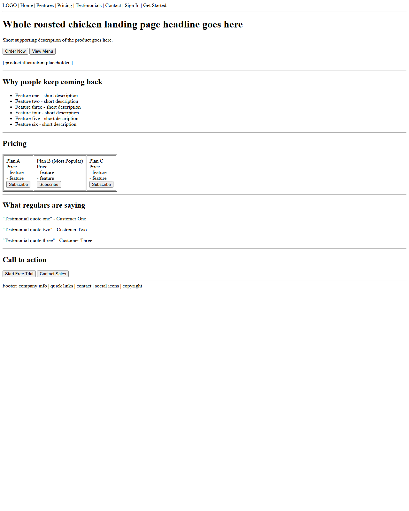
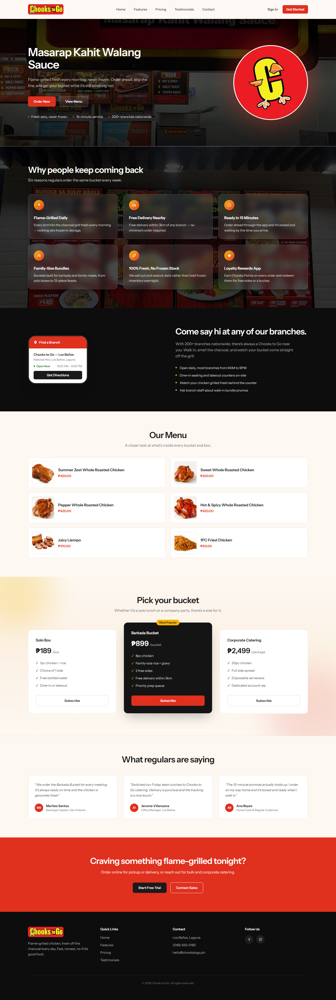
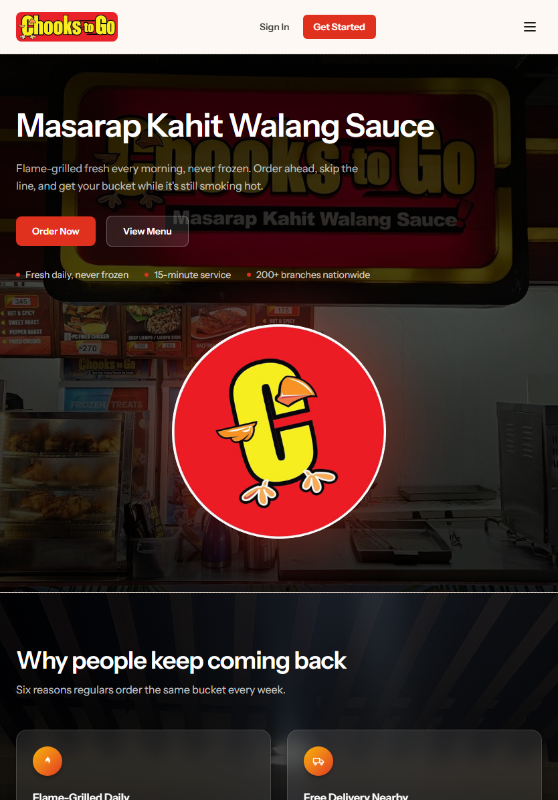
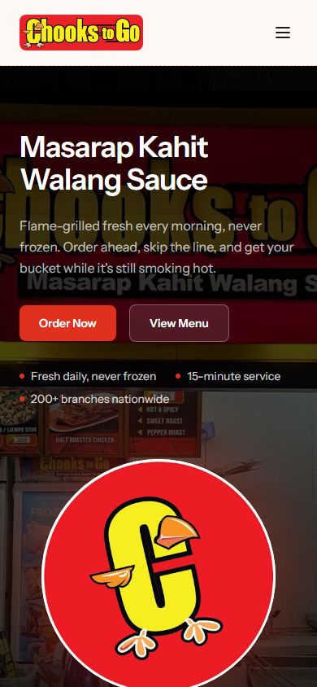
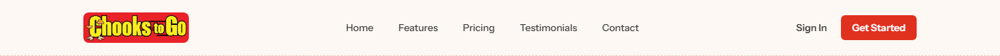
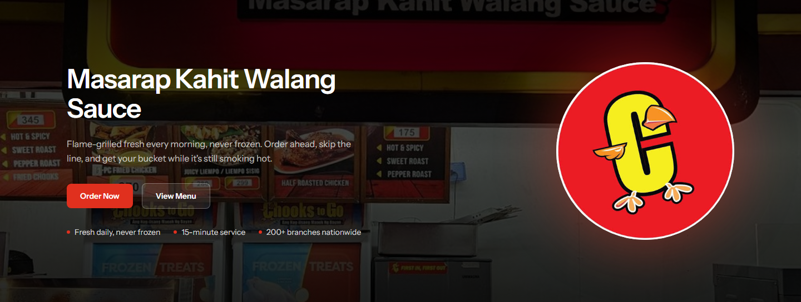
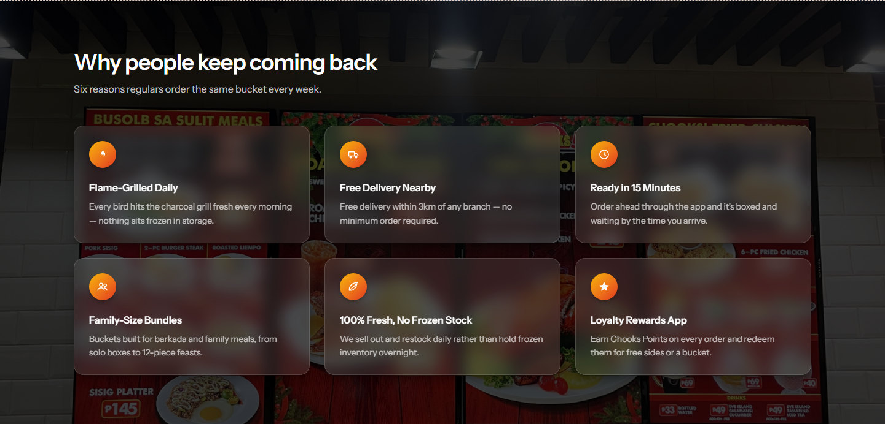
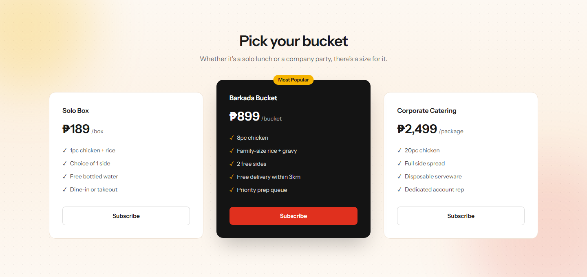
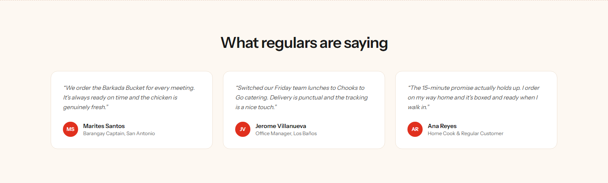
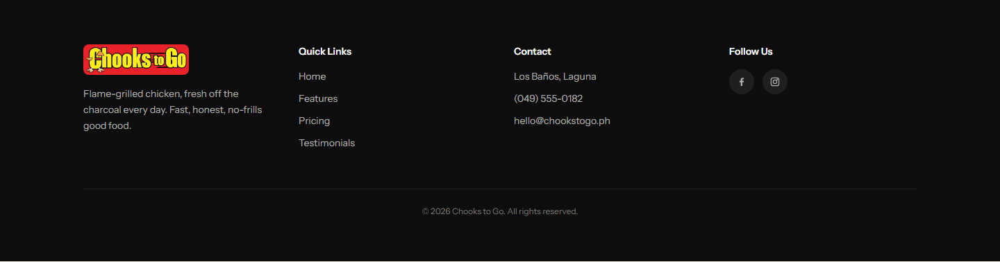

# Chooks to Go — Responsive Product Landing Page

**ITST 302 – Client-Server Technologies · Week 5 · Mini Project 04**
A responsive landing page built with Laravel, Blade Components, and Tailwind CSS for **Chooks to Go**, a real flame-grilled whole-roasted-chicken business.

---

## 1. Introduction

**What is a Product Landing Page?**
A landing page is a single, focused web page designed to introduce a product, service, or brand and guide a visitor toward one clear action — ordering, signing up, or getting in touch. Unlike a full multi-page site, everything a visitor needs (what the business offers, why it's worth choosing, what it costs, what others say about it, and how to reach it) lives on one scrollable page.

**Why landing pages matter for businesses**
For a food business like Chooks to Go, a landing page is often the first impression a customer gets before ever setting foot in a branch. A clear, fast, mobile-friendly page builds trust, communicates pricing and menu items up front, and reduces the friction between "I'm hungry" and "I know where to go."

**Purpose of this project**
This project applies component-based Laravel development and Tailwind CSS to turn Chooks to Go's real branding, menu, and pricing into a clean, responsive, single-page site — while practicing the reusable Blade Component patterns used in production Laravel applications.

---

## 2. Objectives

Through this activity, the following learning objectives were accomplished:

- Built a fully responsive interface using Tailwind CSS utility classes (no custom CSS files).
- Broke the page into reusable Laravel Blade Components instead of one large template.
- Applied responsive layouts with Flexbox and CSS Grid across desktop, tablet, and mobile breakpoints.
- Organized frontend code following Laravel's `layouts / components / pages` view convention.
- Kept a consistent design system: one color palette, one type scale, one spacing rhythm, reused across every section.
- Documented the frontend architecture and component design in this README.

---

## 3. Responsive Web Design

**Mobile-first design.** Base (unprefixed) Tailwind classes target the smallest screen; `sm:`, `md:`, and `lg:` prefixes layer on wider-screen behavior. For example, the navigation links are hidden by default (`hidden`) and only appear at the `lg:` breakpoint (`lg:flex`), with a hamburger toggle covering everything below that.

**Responsive breakpoints used:**
| Breakpoint | Width | Used for |
|---|---|---|
| (default) | < 640px | Phones — single column, stacked sections, hamburger nav |
| `sm:` | ≥ 640px | Small tablets — 2-column feature/menu grids |
| `lg:` | ≥ 1024px | Laptops/desktops — 3-column grids, full nav bar, side-by-side hero |

**Flexbox** handles one-dimensional alignment: centering the nav bar's logo/links/buttons row, laying out button groups, and aligning icon + text pairs in feature cards and menu items (`flex items-center gap-*`).

**CSS Grid** handles two-dimensional layouts: the hero's text-vs-illustration split (`grid lg:grid-cols-2`), the 6-item features grid (`grid sm:grid-cols-2 lg:grid-cols-3`), the 3-tier pricing cards (`grid md:grid-cols-3`), and the footer's 4-column link groups (`grid sm:grid-cols-2 lg:grid-cols-4`).

**User Experience (UX).** Sticky navigation keeps key links reachable while scrolling; anchor links (`#features`, `#pricing`, etc.) give one-click access to any section; hover states on buttons and cards give visual feedback; and color/contrast choices (light text on dark, dark text on light) were adjusted per-section so text stays readable over both photo backgrounds and plain color backgrounds.

Responsive design matters here because most visitors will find this page from a phone (a Facebook link, a Google search while deciding where to eat), so the mobile layout had to work first, not as an afterthought.

---

## 4. Tailwind CSS

**Utility-first CSS.** Instead of writing custom class names and CSS rules, every visual property — spacing, color, radius, shadow, typography — is expressed as small, composable utility classes directly in the markup (`rounded-2xl`, `shadow-lg`, `px-6 py-3`, `text-white/80`).

**Advantages experienced in this project:**
- No context-switching between `.css` files and templates — styling and markup live together.
- Consistent scale: `gap-4`, `gap-6`, `gap-8`, `p-6`, `p-8` reuse the same spacing tokens everywhere instead of one-off pixel values.
- Safe refactors: changing a component's classes never accidentally affects an unrelated element, since nothing is shared by a global class name.

**Responsive utility classes** — e.g. `grid sm:grid-cols-2 lg:grid-cols-3`, `text-4xl sm:text-5xl`, `hidden lg:flex` — let one element declare its mobile, tablet, and desktop behavior in a single line.

**Component styling example** — the primary button style, defined once in `resources/views/components/button.blade.php`:

```blade
$variants = [
    'primary' => 'bg-[#E0301E] text-white hover:bg-[#B82415]',
    'dark'    => 'bg-[#1A1A1A] text-white hover:bg-black',
    'outline' => 'border border-[#1A1A1A]/15 bg-white text-[#1A1A1A] hover:bg-[#F5EEE5]',
];
```

Every button on the page — "Order Now," "Get Started," "Subscribe," "Start Free Trial" — renders through this one file, so a brand color change happens in one place instead of a dozen.

---

## 5. Blade Components

**What are Blade Components?** They're reusable, self-contained view partials — a Blade file that accepts data via `@props` and renders a chunk of markup, invoked elsewhere as an HTML-like tag (e.g. `<x-feature-card :icon="..." :title="..." />`). Laravel auto-discovers any file under `resources/views/components/` as an anonymous component.

**Why reusable components improve maintainability:**
- The 6 feature cards, 3 pricing cards, 3 testimonials, and 6 menu items are each rendered from **one** component definition, looped with data arrays — not six/three/three/six copy-pasted blocks of HTML.
- A design change (say, rounding pricing cards a little more) is a one-line edit in `pricing-card.blade.php` instead of hunting down every repetition.
- Each component has a single, obvious responsibility, which makes the page (`pages/home.blade.php`) read like a table of contents instead of 300+ lines of nested `<div>`s.

**Components built for this project:**

```
resources/views/components/
├── navbar.blade.php          Sticky nav bar: logo, links, sign in/get started, mobile menu
├── hero.blade.php            Hero section shell (title, description, CTAs, stats slot, visual slot)
├── feature-card.blade.php    One feature: icon + title + description
├── pricing-card.blade.php    One pricing plan: name, price, feature list, CTA, "highlighted" state
├── testimonial-card.blade.php One customer review: quote, initials avatar, name, role
├── button.blade.php          Shared button/link with variant + size props
├── footer.blade.php          Site footer: logo, quick links, contact info, social icons, copyright
├── menu-item-card.blade.php  One menu item: photo, name, price (extra component)
└── section-heading.blade.php Centered/left "title + subtitle" heading pattern (extra component)
```

**Sample usage** (from `pages/home.blade.php`):

```blade
@foreach ($features as $feature)
    <x-feature-card :icon="$feature['icon']" :title="$feature['title']" :description="$feature['desc']" />
@endforeach
```

```blade
<x-pricing-card
    name="Barkada Bucket"
    price="₱899"
    period="bucket"
    badge="Most Popular"
    :highlighted="true"
    :features="['8pc chicken', 'Family-size rice + gravy', '2 free sides']"
/>
```

---

## 6. User Interface Design

**Color Palette**
| Swatch | Hex | Role |
|---|---|---|
| 🔴 | `#E0301E` | Brand red — primary buttons, prices, accents |
| ⚫ | `#1A1A1A` / `#0D0D0D` | Near-black — headings, dark sections |
| 🟡 | `#F5B301` | Amber — highlights, "Most Popular" badge, bullet accents |
| 🟠 | `#FDF8F2` | Warm cream — page background |
| ⚪ | `#FFFFFF` | White — cards |
| Grays | `#6B6B6B`, `#4A4A4A`, `#B0AFAC` | Body copy on light/dark backgrounds |

A limited, harmonious palette (red/black/amber/cream) keeps every section feeling like the same brand, whether the background is a photo, solid red, or solid black.

**Typography.** A single font family — **Instrument Sans** (loaded via `@fonts` / Bunny Fonts in `vite.config.js`) — is used throughout, with weight and size doing the work of hierarchy: bold 4xl/5xl for hero headlines, semibold for card titles, regular for body copy.

**Iconography.** All icons are hand-written inline SVGs (flame, truck, clock, users, leaf, star, location pin, social icons) rather than an icon font — no extra HTTP request, and each icon can be recolored with `currentColor`/`fill`/`stroke` to match its container.

**Button Styles.** One `<x-button>` component with `variant` (`primary`, `dark`, `outline`, `outline-light`, `outline-white`, `ghost`) and `size` (`sm`, `md`) props covers every call-to-action on the page, so buttons look and behave consistently everywhere.

**Card Design.** Cards share a consistent shape language: `rounded-2xl`/`rounded-xl`, soft borders (`border-[#F0E4D6]`) or glassmorphism (`bg-white/10 backdrop-blur-md`) depending on what's behind them, and a consistent padding scale (`p-6`, `p-7`, `p-8`).

**Layout Consistency.** Every section shares the same content width (`max-w-7xl mx-auto`), horizontal padding (`px-6 lg:px-10`), and vertical rhythm (`py-20`), so the page feels like one continuous system rather than stitched-together sections.

Together, these choices reduce visual noise and let the food photography and pricing do the talking — which is the whole point of a landing page.

---

## 7. Folder Structure

```
week05-product-landing-page/
├── app/                        Laravel application code (models, providers, etc.)
├── resources/
│   ├── views/
│   │   ├── layouts/
│   │   │   └── app.blade.php       Base HTML document every page extends (@yield('content'))
│   │   ├── components/             Reusable Blade Components (see section 5)
│   │   └── pages/
│   │       └── home.blade.php      The landing page itself — composes components + section data
│   ├── css/app.css              Tailwind entrypoint
│   └── js/app.js                Small vanilla-JS mobile menu toggle
├── public/
│   └── images/                  Product photos, logo, and background images referenced by asset()
├── screenshots/                 Desktop/tablet/mobile + per-section screenshots for submission
├── documentation/                Before-and-after comparison images
└── README.md                    This file
```

- **`resources/views/layouts`** — the single shared HTML shell (head, fonts, Vite assets, `<body>`). Every page extends it with `@extends('layouts.app')` so `<head>` only needs to be written once.
- **`resources/views/components`** — self-contained, reusable UI pieces described above.
- **`resources/views/pages`** — the actual routed pages (currently just `home.blade.php`), each one assembling components and section-specific data rather than raw markup.
- **`public`** — publicly served files, including every image used on the page (`public/images/`).
- **`screenshots`** / **`documentation`** — submission evidence: device screenshots and before/after comparison images (see each folder's own README for the expected filenames).

---

## 8. Before-and-After Comparison

| Before — initial wireframe | After — final responsive design |
|---|---|
|  |  |

The "before" wireframe is plain, unstyled HTML holding the same required sections (nav, hero, features, pricing, testimonials, CTA, footer) with no layout, color, or typography — the equivalent of the page before any Tailwind/Blade-component work began. The "after" screenshot is the final responsive page, styled with the project's cream/red/black brand system and built from the reusable Blade Components described above.

---

## 9. Screenshots

All captured from the live app with Playwright and saved under `screenshots/`:

| | |
|---|---|
| **Desktop** (1440px) |  |
| **Tablet** (834px) |  |
| **Mobile** (390px) |  |
| **Navigation Bar** |  |
| **Hero Section** |  |
| **Features Section** |  |
| **Pricing Cards** |  |
| **Testimonials** |  |
| **Footer** |  |

Still needed from you (can't be captured from the running app):
- VS Code project structure screenshot
- Blade Components folder screenshot
- GitHub repository screenshot (once pushed)

---

## Tech Stack

- [Laravel](https://laravel.com) (PHP 8.5)
- [Tailwind CSS v4](https://tailwindcss.com) via `@tailwindcss/vite`
- Blade Components (anonymous, `resources/views/components/`)
- [Vite](https://vitejs.dev) for asset bundling

## Running Locally

```bash
composer install
npm install
cp .env.example .env
php artisan key:generate
npm run build   # or: npm run dev
php artisan serve
```
